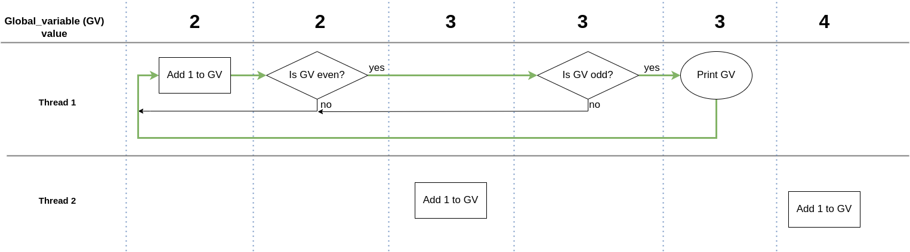

# Threads

This repository contains a basic overview of how threads work (in particular C++ threads) with some simple examples and tasks.

## Overview

This README file briefly describes how threads work in general with some very simple C++ examples. In the `tutorials` directory are a series tasks with example answers in order to help the reader.

## Threads

### What are threads

I find the best way to answer this question is with a very basic example. Take a look at the very basic example below:

```c++
int main() {
    while(true) {
        std::cout << "Hello, World" << std::endl;
    }

    return 0;
}
```

As you can see, the goal of the above code is to simply print `Hello, World` to the screen as quickly as possible. If we were to run this script and take a look at our CPU usage, we'd see that one CPU is most likely running at 100%. By default (i.e. no threading), all scripts run on a single thread.

So, obviously if we were to run the above script we'd see that our console is quickly flooded with the message `Hello, World`. But what about the following example:

```c++
int main() {
    std::string name;
    while(true) {
        std::cout << "Hello, World" << std::endl;
        std::cout << "What is your name: "; 
        std::cin >> name; 
    }

    return 0;
}
```

What about the output of this code? All we've added is a simple `std::cin` right? So surely the console should still be flooded with `Hello, World` right? Unfortunately not, the actual output would look like:

```
Hello, World
What is your name: 
```

And that's it (or until you type your name in of course). That is because `std::cin` is what we refer to as a `blocking call`. That means that all other processes (in this thread) stop/wait until the we move past the function that is currently blocking.

But what if we want to print `What is your name` whilst printing `Hello, World` as fast as we can? Simple... threads. Imagine if you will the following two source files:

```c++

// A.cpp
int main() {
    std::string name;
    while(true) {
        std::cout << "What is your name: "; 
        std::cin >> name; 
    }

    return 0;
}

// B.cpp
int main() {
    while(true) {
        std::cout << "Hello, World" << std::endl;
    }

    return 0;
}

```

And we run A.cpp and B.cpp in two separate consoles/terminals? We'll obviously this will work as we're running the two scripts using two different CPUs/threads. Now we've got our two scripts running in two separate threads, it's time to combine them into one single file. For now I will skip over the terminology of c++ threads. 

To help with the transition let me re-write the above code example:

```c++

// A.cpp
void getName(){
    std::string name;
    while(true) {
        std::cout << "What is your name: "; 
        std::cin >> name; 
    }
}

int main() {
    getName();
    return 0;
}


// B.cpp
void printHelloWorld(){
    while(true) {
        std::cout << "Hello, World" << std::endl;
    }
}

int main() {
    printHelloWorld();
    return 0;
}

```

Incase it's not obvious, I've simply moved the `while-loops` into their own functions (this will make sense when we start threading).
Let's now combine this example into a single source file and add some threads.

```c++

void printHelloWorld(){
    while(true) {
        std::cout << "Hello, World" << std::endl;
    }
}

void getName(){
    std::string name;
    while(true) {
        std::cout << "What is your name: "; 
        std::cin >> name; 
    }
}

int main() {
    std::thread helloWorldThread(printHelloWorld);
    std::thread getNameThread(getName);

    helloWorldThread.join();
    getNameThread.join();

    return 0;
}

```

In this very simple threading example, we actually have three threads running, one for `printHelloWorld`, one for `getName` and finally one for the main application (the parent thread). 
With that high-level overview of the basic idea behind threads complete. I will now go into a little more detail as to what the threading methods do (for example, `join`, `detach`, `swap`, etc).

## Tutorials

| # | Name |
|---|---|
| 1 | [HelloWorld](Tutorials/Basic/HelloWorld/)  |
| 2 | [FunctionPointer](Tutorials/Basic/FunctionPointer/)  |
| 3 | TODO: Lambda Function |
| 4 | TODO: Function Object (Functor) |
| 5 | TODO: Non-static member function |
| 6 | TODO: Static member function | 
| 7 | [Race Condition](Tutorials/Intermediate/RaceCondition/) | 
| 8 | TODO: Mutex example |
| 9 | TODO: Thread lock example |
| 10 | TODO: Get value from threaded function | 


## C++ Threading methods and what they actually do

### Join

One of the most common [thread](https://www.cplusplus.com/reference/thread/thread/) functions you will see while learning about C++ threads is `join`. So what exactly is `join`? When we create a thread on a callable function, for example:

```c++
int main() {
    std::thread t1 (someFunction);

    return 0;
}
```

We're actually [forking](https://en.wikipedia.org/wiki/Fork%E2%80%93join_model) or splitting our current thread into multiple threads. When we add the `join` function to our code. For example:

```c++
int main() {
    std::thread t1 (someFunction);

    t1.join();

    return 0;
}
```

What we are saying is that we want to wait here (i.e move no further) until the thread `t1` has concluded. For a more visual representation of what is happening take a look at the figure below.


As you can see from the above image, when we call `std::thread` we are actually splitting (or forking) from the parent thread. Then we call `join`, we are waiting for the forked thread to re-`join` the main thread. With that said, I prefer to think of the `join` function more of a `wait` function, where we are `waiting for the forked thread to complete it's task`.

NOTE: the `join` function is a `blocking` call. By this I mean the parent thread will wait until the child thread has been completed.

### Detach 

The `detach` function is very useful as it allows us to create a new thread independently of the parent thread. That might sound a little confusing, let's take a look at an example.

```c++

void printForEver() {
    while(true) {
        std::cout << "printing..." << std::endl;
    }
}

int main() {
    std::thread t1 (printForEver);

    t1.join();
    std::cout << "t1 has joined" << std::endl;

    return 0;
}
```

With the above example, the text "t1 has joined" will never be printed. That is because as previously mentioned `join` is a blocking call. This means that all code below `t1.join()` will no be run until `t1` has joined (which it will never do). But what if we want to run the code after `join`? You guessed, `detach`. When we call `t1.detach()` what we are doing is dropping/removing all connections to that thread. Let's take a look at a more visual example.


When we call `detach`, all connections to the thread are dropped. As a result, the parent thread can continue.

#### Issues

There are some issues that are worth noting when using `detach`. 

- With the above code example, it is very likely that `printing...` will not be printed. This is because the parent thread will most likely `return` before the thread `t1` has even been created.
- It is possibly to double-detach a thread resulting in an run-time error. However this is easily solved using `joinable` (more details below).

### Joinable

The function `joinable` is fairly self explanatory but why is it import to use it not so clear. Let's take a look at the code example below

```c++

int main() {
    std::thread t1 (someFunction);

    t1.join();
    t1.join();

    return 0;
}
```

At first glance it may not be obvious what will be the output of this example. However, if we were to run it we would get an error along the lines of `terminate called after throwing an instance of 'std::system_error'` [NOTE: this is a run-time error, so the compiler will not pick this up]. What this means is we're trying to `join` a thread that has already been joined. Now we have two options to avoid this error.

1. Just call `join` once
2. Check if the thread is `joinable`

Whilst option one seems simple it can sometimes be hard to keep track of. Imagine we have several threads with many lines of code, this can make it very difficult to determine if we have already joined or not. Clearly option two is the best approach. Let's take a look at the above example again but with `joinable` added.

```c++
int main() {
    std::thread t1 (someFunction);

    if(t1.joinable())
        t1.join();
    
    if(t1.joinable())
        t1.join();

    return 0;
}
```

The above code will now run without any error.

### Race Condition

Before I drive into what a `mutex` is, I'm first going to describe a problem that can occur when we use threads. Let's consider the following code example:

```c++

int global_variable = 1;
int global_range = 10000;

void evenCheck() {
    for(int i = 0; i < global_range; i++) {
        global_variable++;

        if(global_variable % 2 == 0) {
            std::cout << "\tGlobal Variable is even: " << global_variable << "\n";
        }
    }
}

void increment() {
    for(int i = 0; i < global_range; i++) {
        global_variable++;
    }
}

int main() {

    std::thread t1(evenCheck);
    std::thread t2(increment);

    t1.join();
    t2.join();

    return 0;
}

```

At first glance the above code may look perfectly fine, however what if I said that every now and then the print statement will print an odd number. This is due to what we call the `race condition`. To make it clearer (and easier to see if you run it), let's look at a modified code snippet.

```c++

if(global_variable % 2 == 0) {
    if(global_variable % 2 != 0) {
        std::cout << "\tGlobal Variable is even: " << global_variable << "\n";
    }
}
```

If I showed you the above code and asked you "Will this statement ever be printed?" you'll obviously say "no", how can a number be both odd and even at the same time. Well here lies the root of the problem. Let's take a look at this from a more visual stand point.



Let me explain the above image. As you can see we have three 'rows'. The first row represents the current value of `global_variable`. The next row shows what thread one (evenCheck) is doing and finally the third row shows us what thread two (increment) is doing. The columns represent each time either thread performs an action (increment, check, print, etc). By including the current value of `global_variable` we are able to see what value is passed into the check. I've also included a green arrow to show what the flow.

As you can see from the above image, initially when check to see if global_variable this is 'true'. However before thread one is able to check if global_variable is even, thread two increments the value of global_variable. This results in the final odd check return true. This in turn allows us to print "Global Variable is even: 3". [Click here to access the code](Tutorials/Intermediate/RaceCondition/src/raceCondition.cpp).

Now we know what a `race condition` is, let's now start looking into how we can prevent this from happening.

### Mutex


Race condition 
- lock
- unlock
- problem with these two commands and why not to use them (Exceptions)

### Lock_guard

### Lock

### Unique_lock

- Do unique_locks need to be "unlocked" or is this done automatically (i.e. when we go out of scope)
- The benefit of this is that in case some exception is thrown, you are sure that the mutex will unlock when leaving the scope where the std::unique_lock is defined.

### Once_flag & Call_once

### Condition_variable 

- notify_one
- notify_all
- wait
  - Will automatically unlock the thread
  - Has to be a unique_lock (as we are unlocking and locking). We cannot use lock_guard
  - Spurious wake
  - Predicator 
- MORE

### Async 

- May or may not create another thread
- std::launch

### Future
    - templated 

### Promise
    - templated


### Shared_future
- Can be copied

## Chrono

### Thread sleeping


## Key terms

### Race Condition

### Thread lock

### Deadlock


# Low-level

So I've given an overview of some functions and use-cases of C++ Threads but haven't really spoken about what is happening "Under the hood", so to speak. In this section, I'm going to give a more detailed explanation of how the various types of threads and how they interact with the CPU.

First, the types of threads. 
 * User Level Threads (ULT)
 * Kernel Level Threads (KLT)
 * Hardware threads (Hyperthreading)

The following sections will explain what each of these are and their limitations. Finally I will explain how they all communicate with each other.

## User Level Threads (ULT)

Before I can explain what a User Level Thread is, I first need to explain what a `process` is. As always, I find learning by example, is easier.

If we create a very simple programme, say `Hello, World`. When we execute this programme, what you are creating is a `process`. This process doesn't just contain the executable code but lots of important features. [The University of Illinois](https://cs.uic.edu/) has a very simple picture that depicts some of the important features of a `process`.Take a look at the left side of the picture below denoting a simple process (singly-threaded).

<center>

</center>

As you can see, when we run our programme the "computer" creates a series of "Helper Features". Whilst I could go into detail about each of these features, I'm going to focus on the "thread" aspect. As you've probably noticed, when we execute our programme, at least one thread is created. This is referred to as the `main-thread`. If in our programme we create more threads, then our programme becomes a `multithreaded process` (The right side of the above image).

It's these `process threads` which are referred to as `User Level Threads` as the user can manually create these threads.

A nice StackOverflow answer by [Yusuf Hassan](https://stackoverflow.com/a/41217646/740445) is: 

```wrap
Threads are lightweight processes within the domain of independent processes. They are required because processes are heavy, consume a lot of resources and more importantly, two separate processes cannot share a memory space.
```


## Kernel Level Threads (KLT)

Whilst you've most likely not heard of the term `User Level Threads`, you probably did know what they are. However, most people have never heard of `Kernel Level Threads`. 

As you have probably guessed, these threads exist in the `kernel` realm of the computer. This area is not accessible to the user (you). So why have a kernel level at all? In general, the CPU can only communicate with Kernel and not the user. Put even simpler, the only "thing" that can tell the CPU (or other hardware devices) what to do is the kernel. 

A more scientific answer is this, whenever we need to perform a [system call](https://en.wikipedia.org/wiki/System_call#:~:text=In%20computing%2C%20a%20system%20call,on%20which%20it%20is%20executed.&text=System%20calls%20provide%20an%20essential,process%20and%20the%20operating%20system.), we have to go through a Kernel Thread as this calls can only be computed by the CPU. 

Typically Kernel Level Threads are slower than User Level Threads. An answer by [pjc50](https://superuser.com/users/10680/pjc50) on [superuser](https://superuser.com/questions/669883/why-are-user-level-threads-faster-than-kernel-level-threads) explains why this is the case.

```
Kernel-level threads require a context switch, which involves changing a large set of processor registers that define the current memory map and permissions. It also evicts some or all of the processor cache.

User-level threads just require a small amount of bookkeeping within one kernel thread or process.
```


## CPU Threads (Hyperthreads)

You've most likely come see CPU companies advertise something called `virtual cores` or `hyperThreading`. In this section I'll give a brief overview of what hyperThreading is however I will also share some links to a range of excellent, short video explanations. 

As you are probably aware, a single CPU-core can only perform one task at a time. As a result, CPU manufactures "addressed" this problem by creating CPUs with more cores. However, when switching between tasks, there is a significant delay. In order to address this Intel created the first hyperthreaded CPU. So what does this actually mean? 

[Techquickie](https://www.youtube.com/channel/UC0vBXGSyV14uvJ4hECDOl0Q)'s Linus uploaded [this](https://www.youtube.com/watch?v=wnS50lJicXc&ab_channel=Techquickie) video which explains it beautifully. 

For this example, I'm going to explain a single-cored, single-threaded CPU using `mouths` and `arms`. Imagine that your mouth is the CPU-core and your arm is the thread, and in front of you is a conveyor belt of food (where the food represents tasks). Every time a new piece of food appears in front of you, your arm moves to grab that piece of food and brings it to your mouth for processing. However, once you've stopped eating, you have to move your arm away from your mouth to grab the next piece of food from the conveyor belt. In this moment, your mouth is not eating (processing) anything. In order to address this problem we add in another arm (thread). Whilst one arm is holding the food to your mouth (core), the other arm (thread) is grabbing the next piece of food to be processed.

If you want another explanation behind hyperThreading I would recommend [this](https://www.youtube.com/watch?v=mSZpDF-zUoI) video by [Gary Explains
](https://www.youtube.com/channel/UCRjSO-juFtngAeJGJRMdIZw).


## How do all these all connect?

At this point, you should have a basic idea of `User Level Threads`, `Kernel Level Threads` and `HyperThreads`. However, how these these components connect is a little bit tricky.

Let's start by seeing how ULT interact with KLT.

### ULT and KLT


```
The term threads usually covers three abstraction layers:

User threads are threads launched by applications and are mapped N:M to:
Kernel threads, which are threads managed by the operating system, mapped N:M to:
Hardware threads, which are the actual physical resources available.
The 4 threads you said are launched by the application are from category 1 (user threads), while the value 2 returned by that function refers to category 3 (hardware threads). Since the mapping is N:M across the layers, you can see that you can have several user threads mapped to a smaller number of hardware threads.

Having said this, typically starting more than 2x the number of hardware threads if you are doing intensive computations will hurt performance due to context switches and resource contention.
```

```
Dependency between ULT and KLT : 
The one and only major dependency between KLT and ULT arise when an ULT is in need of the Kernel resources. Every ULT thread is associated to a virtual processor called Light-weight process. This is created and binned to ULT by the thread library according to the application need. Whenever a system call invoked, a kernel level thread is created and scheduled to the LWPs by the system scheduler. These KLT are scheduled to access the kernel resources by the system scheduler which is unaware of the ULT. Whereas the KLT is aware of each ULT associated to it via LWPs. 
```
https://www.geeksforgeeks.org/relationship-between-user-level-thread-and-kernel-level-thread/


```
preemptively or cooperatively
concurrently vs parrellelly 
```

```
The term "light-weight process" variously refers to user threads or to kernel mechanisms for scheduling user threads onto kernel threads.


context switching between threads in the same process typically occurs faster than context switching between processes
```
https://en.wikipedia.org/wiki/Thread_(computing)#:~:text=User%20threads%20may%20be%20executed,user%20threads%20onto%20kernel%20threads.


https://stackoverflow.com/questions/46619223/difference-between-cpu-threads-kernel-threads-os-threads-user-threads
https://www.youtube.com/watch?v=w0t8nA6ssrw&ab_channel=OSCAAcademy
https://www.geeksforgeeks.org/difference-between-process-and-kernel-thread/
https://stackoverflow.com/questions/1178785/relationship-between-a-kernel-and-a-user-thread
https://stackoverflow.com/questions/16322446/what-exactly-is-a-kernel-thread-and-how-does-it-work-with-processes
https://stackoverflow.com/questions/4985182/what-is-the-difference-between-kernel-threads-and-user-threads?rq=1
https://www.geeksforgeeks.org/why-must-user-threads-be-mapped-to-a-kernel-thread/#:~:text=All%20the%20user%20threads%20that,hence%20the%20process%20is%20executed.
https://en.wikipedia.org/wiki/Thread_(computing)#:~:text=User%20threads%20may%20be%20executed,user%20threads%20onto%20kernel%20threads.
https://unix.stackexchange.com/questions/472324/what-are-the-relations-between-processes-kernel-threads-lightweight-processes
https://stackoverflow.com/questions/40707221/multithreading-model-in-linux-and-windows

## Hyper-threading (Hardware threads)

## Multi-threading

## Kernel-threading (lightweight process)

Use the kernel thread to access system calls

### System calls

## OS-threading

## Useful Links

As you can imagine, this section required lots of research. As a result, below are some of the links I used during my time researching this area.

 * [Why are user level threads faster than kernel level threads?](https://superuser.com/questions/669883/why-are-user-level-threads-faster-than-kernel-level-threads)

# Useful links

https://www.youtube.com/watch?v=hCvc9y39RDw&ab_channel=CppNuts
https://www.youtube.com/watch?v=SZQ6-pf-5Us&ab_channel=BoQian