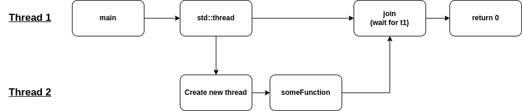
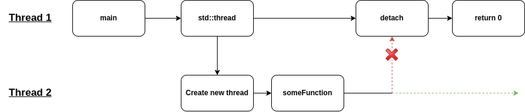

# Threads

This repository contains a basic overview of how threads work (in particular C++ threads) with some simple examples and tasks.

## Overview

This README file briefly describes how threads work in general with some very simple C++ examples. In the `tutorials` directory are a series tasks with example answers in order to help the reader.

## Threads

### What are threads

I find the best way to answer this question is with a very basic example. Take a look at the very basic example below:

```c++
int main() {
    while(true) {
        std::cout << "Hello, World" << std::endl;
    }

    return 0;
}
```

As you can see, the goal of the above code is to simply print `Hello, World` to the screen as quickly as possible. If we were to run this script and take a look at our CPU usage, we'd see that one CPU is most likely running at 100%. By default (i.e. no threading), all scripts run on a single thread.

So, obviously if we were to run the above script we'd see that our console is quickly flooded with the message `Hello, World`. But what about the following example:

```c++
int main() {
    std::string name;
    while(true) {
        std::cout << "Hello, World" << std::endl;
        std::cout << "What is your name: "; 
        std::cin >> name; 
    }

    return 0;
}
```

What about the output of this code? All we've added is a simple `std::cin` right? So surely the console should still be flooded with `Hello, World` right? Unfortunately not, the actual output would look like:

```
Hello, World
What is your name: 
```

And that's it (or until you type your name in of course). That is because `std::cin` is what we refer to as a `blocking call`. That means that all other processes (in this thread) stop/wait until the we move past the function that is currently blocking.

But what if we want to print `What is your name` whilst printing `Hello, World` as fast as we can? Simple... threads. Imagine if you will the following two source files:

```c++

// A.cpp
int main() {
    std::string name;
    while(true) {
        std::cout << "What is your name: "; 
        std::cin >> name; 
    }

    return 0;
}

// B.cpp
int main() {
    while(true) {
        std::cout << "Hello, World" << std::endl;
    }

    return 0;
}

```

And we run A.cpp and B.cpp in two separate consoles/terminals? We'll obviously this will work as we're running the two scripts using two different CPUs/threads. Now we've got our two scripts running in two separate threads, it's time to combine them into one single file. For now I will skip over the terminology of c++ threads. 

To help with the transition let me re-write the above code example:

```c++

// A.cpp
void getName(){
    std::string name;
    while(true) {
        std::cout << "What is your name: "; 
        std::cin >> name; 
    }
}

int main() {
    getName();
    return 0;
}


// B.cpp
void printHelloWorld(){
    while(true) {
        std::cout << "Hello, World" << std::endl;
    }
}

int main() {
    printHelloWorld();
    return 0;
}

```

Incase it's not obvious, I've simply moved the `while-loops` into their own functions (this will make sense when we start threading).
Let's now combine this example into a single source file and add some threads.

```c++

void printHelloWorld(){
    while(true) {
        std::cout << "Hello, World" << std::endl;
    }
}

void getName(){
    std::string name;
    while(true) {
        std::cout << "What is your name: "; 
        std::cin >> name; 
    }
}

int main() {
    std::thread helloWorldThread(printHelloWorld);
    std::thread getNameThread(getName);

    helloWorldThread.join();
    getNameThread.join();

    return 0;
}

```

In this very simple threading example, we actually have three threads running, one for `printHelloWorld`, one for `getName` and finally one for the main application (the parent thread). 
With that high-level overview of the basic idea behind threads complete. I will now go into a little more detail as to what the threading methods do (for example, `join`, `detach`, `swap`, etc).

## Tutorials

| # | Name |
|---|---|
| 1 | [HelloWorld](Tutorials/Basic/HelloWorld/)  |

## C++ Threading methods and what they actually do

### Join

One of the most common [thread](https://www.cplusplus.com/reference/thread/thread/) functions you will see while learning about C++ threads is `join`. So what exactly is `join`? When we create a thread on a callable function, for example:

```c++
int main() {
    std::thread t1 (someFunction);

    return 0;
}
```

We're actually [forking](https://en.wikipedia.org/wiki/Fork%E2%80%93join_model) or splitting our current thread into multiple threads. When we add the `join` function to our code. For example:

```c++
int main() {
    std::thread t1 (someFunction);

    t1.join();

    return 0;
}
```

What we are saying is that we want to wait here (i.e move no further) until the thread `t1` has concluded. For a more visual representation of what is happening take a look at the figure below.



As you can see from the above image, when we call `std::thread` we are actually splitting (or forking) from the parent thread. Then we call `join`, we are waiting for the forked thread to re-`join` the main thread. With that said, I prefer to think of the `join` function more of a `wait` function, where we are `waiting for the forked thread to complete it's task`.

NOTE: the `join` function is a `blocking` call. By this I mean the parent thread will wait until the child thread has been completed.

### Detach 

The `detach` function is very useful as it allows us to create a new thread independently of the parent thread. That might sound a little confusing, let's take a look at an example.

```c++

void printForEver() {
    while(true) {
        std::cout << "printing..." << std::endl;
    }
}

int main() {
    std::thread t1 (printForEver);

    t1.join();
    std::cout << "t1 has joined" << std::endl;

    return 0;
}
```

With the above example, the text "t1 has joined" will never be printed. That is because as previously mentioned `join` is a blocking call. This means that all code below `t1.join()` will no be run until `t1` has joined (which it will never do). But what if we want to run the code after `join`? You guessed, `detach`. When we call `t1.detach()` what we are doing is dropping/removing all connections to that thread. Let's take a look at a more visual example.



When we call `detach`, all connections to the thread are dropped. As a result, the parent thread can continue.

#### Issues

There are some issues that are worth noting when using `detach`. 

- With the above code example, it is very likely that `printing...` will not be printed. This is because the parent thread will most likely `return` before the thread `t1` has even been created.
- It is possibly to double-detach a thread resulting in an run-time error. However this is easily solved using `joinable` (more details below).

Issues, main thread can complete before other thread does

### Joinable

The function `joinable` is fairly self explanatory but why is it import to use it not so clear. Let's take a look at the code example below

```c++

int main() {
    std::thread t1 (someFunction);

    t1.join();
    t1.join();

    return 0;
}
```

At first glance it may not be obvious what will be the output of this example. However, if we were to run it we would get an error along the lines of `terminate called after throwing an instance of 'std::system_error'` [NOTE: this is a run-time error, so the compiler will not pick this up]. What this means is we're trying to `join` a thread that has already been joined. Now we have two options to avoid this error.

1. Just call `join` once
2. Check if the thread is `joinable`

Whilst option one seems simple it can sometimes be hard to keep track of. Imagine we have several threads with many lines of code, this can make it very difficult to determine if we have already joined or not. Clearly option two is the best approach. Let's take a look at the above example again but with `joinable` added.

```c++
int main() {
    std::thread t1 (someFunction);

    if(t1.joinable())
        t1.join();
    
    if(t1.joinable())
        t1.join();

    return 0;
}
```

The above code will now run without any error.