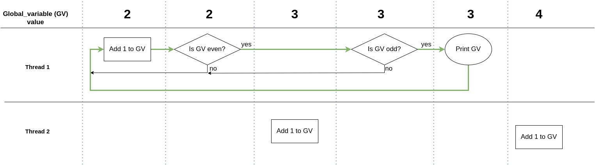

# Tutorial -> Race Condition

Before you can fully appreciate why we use measures like `mutex`, `guards`, `Unique_lock`, etc, you first need to understand what a race condition is. Whilst this section is not necessary a tutorial, it does outline and explain what is meant by the term `race condition`. Let's take a look at a very simple example:

```c++

int global_variable = 1;
int global_range = 10000;

void evenCheck() {
    for(int i = 0; i < global_range; i++) {
        global_variable++;

        if(global_variable % 2 == 0) {
            std::cout << "\tGlobal Variable is even: " << global_variable << "\n";
        }
    }
}

void increment() {
    for(int i = 0; i < global_range; i++) {
        global_variable++;
    }
}

int main() {

    std::thread t1(evenCheck);
    std::thread t2(increment);

    t1.join();
    t2.join();

    return 0;
}

```

At first glance the above code may look perfectly fine, however what if I said that every now and then the print statement will print an odd number. This is due to what we call the `race condition`. To make it clearer (and easier to see if you run it), let's look at a modified code snippet.

```c++

if(global_variable % 2 == 0) {
    if(global_variable % 2 != 0) {
        std::cout << "\tGlobal Variable is even: " << global_variable << "\n";
    }
}
```

If I showed you the above code and asked you "Will this statement ever be printed?" you'll obviously say "no", how can a number be both odd and even at the same time. Well here lies the root of the problem. Let's take a look at this from a more visual stand point.



Let me explain the above image. As you can see we have three 'rows'. The first row represents the current value of `global_variable`. The next row shows what thread one (evenCheck) is doing and finally the third row shows us what thread two (increment) is doing. The columns represent each time either thread performs an action (increment, check, print, etc). By including the current value of `global_variable` we are able to see what value is passed into the check. I've also included a green arrow to show what the flow.

As you can see from the above image, initially when check to see if global_variable this is 'true'. However before thread one is able to check if global_variable is even, thread two increments the value of global_variable. This results in the final odd check return true. This in turn allows us to print "Global Variable is even: 3". [Click here to access the code](/src/raceCondition.cpp)